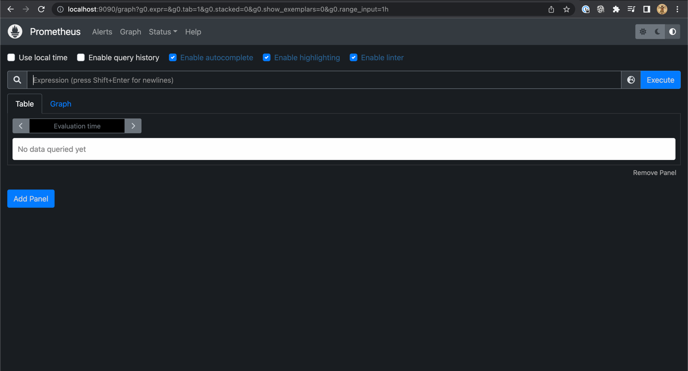

## Kubernetes version of Grafana/Prometheus

### Deployment

#### Create persistent claims to put configs to
```
kubectl apply -f grafana.yaml -l io.kompose.service=grafana-claim0
kubectl apply -f prometheus.yaml -l io.kompose.service=prometheus-claim0
```

#### Put configs
1) Create provisioner pod
```
cat <<EOF | kubectl apply -f -
apiVersion: v1
kind: Pod
metadata:
  name: configs-provisioner
spec:
  volumes:
    - name: grafana-claim0
      persistentVolumeClaim:
        claimName: grafana-claim0
    - name: prometheus-claim0
      persistentVolumeClaim:
        claimName: prometheus-claim0
  containers:
    - name: ubuntu
      image: ubuntu:latest
      # Just sleep forever
      command: [ "sleep" ]
      args: [ "infinity" ]
      volumeMounts:
        - mountPath: "/grafana-claim0"
          name: grafana-claim0
        - mountPath: "/prometheus-claim0"
          name: prometheus-claim0
EOF
```
2) Wait till pod starts 
3) Put configs into it
```
kubectl cp prometheus-grafana/grafana/* configs-provisioner:/grafana-claim0
kubectl cp prometheus-grafana/prometheus/* configs-provisioner:/prometheus-claim0
```
4) Delete provisioner pod
```
kubectl delete pod configs-provisioner
```

#### Start Grafana
```
kubectl apply -f grafana.yaml
```

#### Start Prometheus
```
kubectl apply -f prometheus.yaml
```

### Usage
#### Access grafana
1) Forward port
```
kubectl port-forward service/grafana 3000:3000
```
2) Go to `http://localhost:3000/login` and use creds `admin` / `grafana`:


#### Access prometheus
1) Forward port
```
kubectl port-forward service/prometheus 9090:9090
```
2) Go to `http://localhost:9090`:

